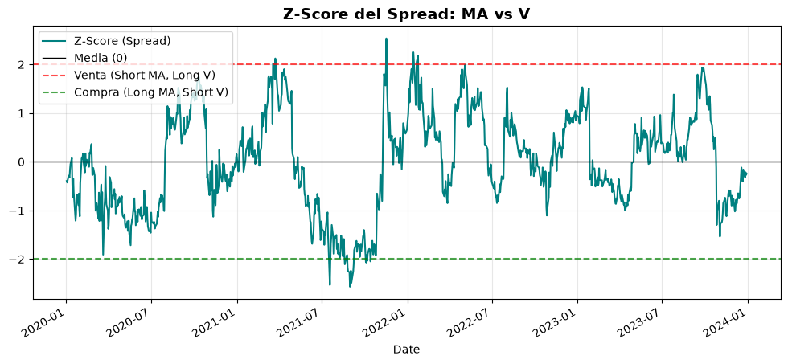
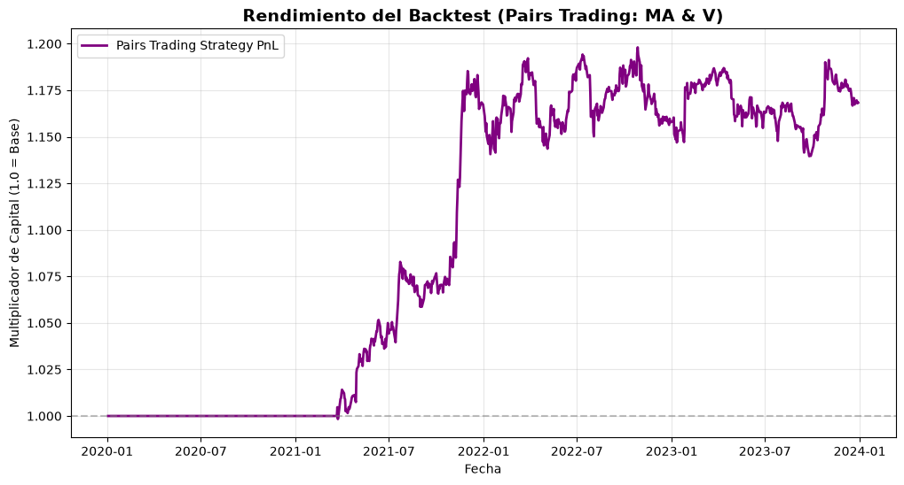

# Statistical Arbitrage: Pairs Trading Strategy (Visa & Mastercard)

An end-to-end quantitative research project implementing a **Statistical Arbitrage (Pairs Trading)** strategy. This repository demonstrates the application of econometrics and mean-reversion principles to exploit short-term pricing inefficiencies between highly correlated assets.

This project was built to showcase proficiency in time-series analysis, statistical testing, vectorized backtesting, and market-neutral trading concepts.

## Project Objective
The goal is to mathematically identify two assets that are tied together by underlying economic fundamentals (in this case, Visa and Mastercard) and prove their relationship is stationary. By calculating the historical spread, the algorithm detects when the pricing diverges significantly and executes trades betting on a mean reversion, ensuring a **market-neutral** stance (profiting regardless of whether the broader market goes up or down).

## Tech Stack & Methodology
* **Data Extraction:** Historical OHLCV data via `yfinance`.
* **Econometrics (`statsmodels`, `scipy`):** 
  * Ordinary Least Squares (OLS) regression to calculate the Hedge Ratio ($\beta$).
  * **Engle-Granger Two-Step Test** to confirm statistical cointegration (stationary spread).
* **Signal Generation (`pandas`, `numpy`):** Normalizing the spread into a Z-Score to create entry ($\pm 2\sigma$) and exit (mean) thresholds.
* **Vectorized Backtesting:** Built a custom pandas-based backtester that strictly avoids Lookahead Bias by shifting trading signals to $T+1$.

## The Math Behind the Alpha

### 1. Cointegration vs Correlation
While correlation only measures if two assets move in the same direction, cointegration proves that the distance between them (the Spread) remains constant over time. 
The spread is defined as:
$$Spread = Y - \beta X$$
*(Where $\beta$ is the Hedge Ratio derived from OLS).*

### 2. Trading Signals (Z-Score)
To standardise the spread and generate actionable triggers, we calculate the rolling Z-Score:
$$Z = \frac{Spread - \mu}{\sigma}$$
* **Entry (Short Spread):** If $Z > +2.0$, Mastercard (MA) is overvalued relative to Visa (V). The algorithm shorts MA and goes long V.
* **Entry (Long Spread):** If $Z < -2.0$, MA is undervalued relative to V. The algorithm goes long MA and shorts V.
* **Exit:** Positions are liquidated when the Z-Score crosses $0$ (mean reversion achieved).

## Visualizing the Strategy

### 1. The Spread Tension (Z-Score Thresholds)
*The algorithm waits patiently for the Z-score to break the $\pm 2$ standard deviation barriers before deploying capital.*



### 2. Backtest Equity Curve (PnL)
*Unlike trend-following strategies, this market-neutral approach results in a step-like equity curve, capturing alpha during brief moments of pricing inefficiency and remaining in cash otherwise.*



## 🚀 How to Run Locally

1. **Clone the repository:**
   ```bash
   git clone [https://github.com/davidnavallefler-byte/pairs-trading-quant.git](https://github.com/davidnavallefler-byte/pairs-trading-quant.git)
   cd pairs-trading-quant
   ```
2. **Create a virtual environment and install dependencies:**
    ```bash
    python -m venv venv
    source venv/bin/activate  # On Windows use: venv\Scripts\activate
    pip install pandas yfinance matplotlib statsmodels scipy
3. **Run the pipeline sequentially:**
    ```bash
    python data_loader.py           # Extracts and normalizes data
    python cointegration_test.py    # Runs OLS and Engle-Granger tests
    python backtester.py            # Executes the trading simulation
    ```
